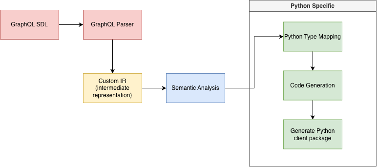

# Nabu Forge

A schema-driven compiler that transforms GraphQL SDL and operation definitions into type-safe Python client packages.

```text
GraphQL SDL + operations  ->  Nabu Forge  ->  Typed Python client package
```

## What it does

Given a GraphQL schema and operation documents, Nabu Forge generates a complete Python package with:

- Pydantic v2 models for every response shape, with correct list/nullability handling
- Discriminated unions for interfaces and polymorphic types (via `__typename`)
- Enum definitions (`str, Enum`)
- Input models with camelCase -> snake_case aliasing for correct wire serialization
- Async client methods with typed variables and response deserialization
- Custom scalar mappings via config
- Async httpx transport with configurable timeout and persistent connection
- Compiler-style diagnostics with file/line/column and hints

### Example generated usage

```python
from generated_client import Client

# basic usage
client = Client(url="https://example.com/graphql", headers={"Authorization": "Bearer token"})
result = await client.get_student(id="123")
print(result.student.id, result.student.status)

# async context manager for clean connection teardown
async with Client(url="https://example.com/graphql") as client:
    result = await client.get_student(id="123")
```

## Installation

```bash
pip install nabu-forge
```

Or for development:

```bash
cd nabu-forge
pip install -e .
```

## Usage

### 1. Write a `nabu.toml`

```toml
schema = "schema.graphqls"
operations = "operations/"
output = "generated_client"

[scalars]
DateTime = "datetime.datetime"
JSON = "typing.Any"
Void = "None"
```

### 2. Run

```bash
nabu validate --config nabu.toml      # validate without writing files
nabu inspect  --schema schema.graphqls # show schema structure
nabu generate --config nabu.toml      # generate the client package
```

## Configuration

| Field        | Description                                     |
|--------------|-------------------------------------------------|
| `schema`     | Path to the GraphQL SDL file                    |
| `operations` | Directory containing `.graphql` operation files |
| `output`     | Output directory for the generated package      |
| `[scalars]`  | Python type mappings for custom scalars         |

All paths are relative to `nabu.toml`.

## GraphQL → Python type mapping

| GraphQL       | Python                      |
|---------------|-----------------------------|
| `String!`     | `str`                       |
| `String`      | `str \| None`               |
| `[String!]!`  | `list[str]`                 |
| `[String]`    | `list[str \| None] \| None` |
| `Int!`        | `int`                       |
| `Float!`      | `float`                     |
| `Boolean!`    | `bool`                      |
| `ID!`         | `str`                       |
| Custom scalar | configured via `[scalars]`  |

camelCase GraphQL field names are converted to `snake_case`. A `Field(alias="camelCase")` is emitted automatically so
generated models deserialize real GraphQL responses correctly.

## Polymorphic types (interfaces and unions)

Inline fragments generate discriminated union aliases using `__typename` as the discriminator. Shared interface-level
fields appear in every member class — you do not need to repeat them in each fragment.

```graphql
query GetJob($id: String!) {
    job(id: $id) {
        jobId          # shared — emitted in ALL member classes
        state
        ... on ExecutionJob  { task { name } }
        ... on CollectionJob { }
    }
}
```

Generated:

```python
class GetJobJobExecutionJob(BaseModel):
    model_config = ConfigDict(populate_by_name=True)
    typename: Literal["ExecutionJob"] = Field(alias="__typename")
    job_id: str = Field(..., alias="jobId")  # shared
    state: JobState  # shared
    task: GetJobJobExecutionJobTask | None


GetJobJob = Annotated[
    GetJobJobExecutionJob | GetJobJobCollectionJob,
    Field(discriminator="typename"),
]
```

`__typename` is injected automatically in the sent document — no need to add it to your `.graphql` files.

## Diagnostics

Nabu Forge emits compiler-style diagnostics. Errors abort generation; warnings print and continue.

```
error[E023]: Field 'ghost' does not exist on type 'Query'.
  operations/bad.graphql:2:5

warning[E029]: Field 'job' returns polymorphic type 'Job' but has no inline fragments.
  operations/get_job.graphql:3:5
  hint: Add '... on ConcreteType { fields }' for each possible type.
```

| Code | Severity | Meaning                                    |
|------|----------|--------------------------------------------|
| E001 | error    | Config file not found                      |
| E002 | error    | Missing required config fields             |
| E010 | error    | GraphQL syntax error                       |
| E020 | error    | Unknown type reference                     |
| E021 | error    | Unmapped custom scalar                     |
| E022 | error    | Unknown variable type                      |
| E023 | error    | Unknown field / direct field on union type |
| E024 | error    | Unknown fragment spread                    |
| E025 | error    | Bad inline fragment target                 |
| E026 | error    | Generated name collision                   |
| E028 | error    | Unsupported feature (subscriptions)        |
| E030 | error    | File write error                           |

## Compiler pipeline



## Supported / not supported

**Supported:**

- Object types, input types, enums, interfaces, unions
- Lists and nullability (all 8 combinations)
- Custom scalars via `[scalars]` config
- Queries and mutations
- Named fragments (inlined at codegen time)
- Inline fragments → discriminated unions via `__typename`
- Shared interface fields alongside inline fragments
- Field aliases including two aliases of the same underlying field
- camelCase → snake_case with `Field(alias=...)`
- Async httpx transport with `timeout`, persistent `AsyncClient`, `async with` support

**Not supported:**

- Subscriptions (E028 at semantic analysis)
- File uploads (multipart)
- Query batching
- `@skip` / `@include` directives
- Variable default values
- Introspection-based generation (SDL file required)

## Development

```bash
pip install -e .

ruff check src/         # lint
pytest                  # 144 tests
nabu generate --config samples/university/nabu.toml
```

## Architecture docs

- [`architecture/overview.md`](architecture/overview.md) — project summary and goals
- [`architecture/compiler-pipeline.md`](architecture/compiler-pipeline.md) — all pipeline stages
- [`architecture/generated-package.md`](architecture/generated-package.md) — generated package layout
- [`architecture/diagnostics-and-cli.md`](architecture/diagnostics-and-cli.md) — CLI and diagnostics design
- [`architecture/development-plan.md`](architecture/development-plan.md) — implementation phases
- [`architecture/product-requirements.md`](architecture/product-requirements.md) — scope and definition of done
