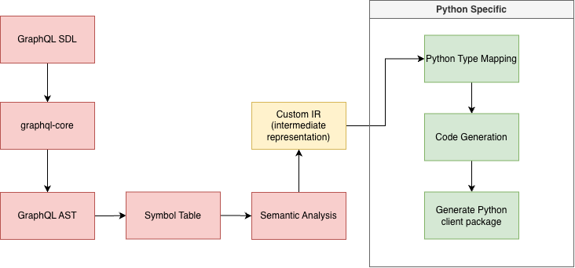
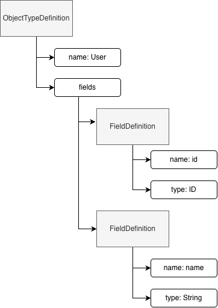

# Compiler Pipeline

The proposed compiler pipeline is:



Each stage has a specific responsibility.

---

## 1. GraphQL SDL Input

The source language of the compiler is GraphQL Schema Definition Language.

Example:

```graphql
scalar DateTime

enum EnrollmentStatus {
    ENROLLED
    ACTIVE
    GRADUATED
    WITHDRAWN
}

type Student {
    id: ID!
    status: EnrollmentStatus!
    createdAt: DateTime!
}

type Query {
    student(id: ID!): Student
}
```

The schema defines:

* object types;
* input types;
* enums;
* scalars;
* interfaces;
* unions;
* queries;
* mutations;
* field arguments;
* list structures;
* field nullability.

The schema describes what the API supports, but it does not contain enough information to generate precise response
models for every possible operation.

For this reason, Nabu Forge should also support GraphQL operation documents.

Example:

```graphql
query GetStudent($id: ID!) {
    student(id: $id) {
        id
        status
        createdAt
    }
}
```

---

## 2. Parsing with `graphql-core`

The `graphql-core` library should be used as the GraphQL frontend parser.

Example:

```python
from graphql import parse

document = parse(schema_source)
```

The library is responsible for:

* lexical analysis;
* parsing GraphQL syntax;
* producing a GraphQL AST;
* validating standard GraphQL syntax;
* constructing a GraphQL schema model;
* validating operations against the schema.

Nabu Forge does not need to implement a complete GraphQL parser unless parser construction becomes a separate academic
goal.

Using an existing parser does not make the project a simple wrapper. The parser is only the frontend component of the
complete compiler pipeline.

---

## 3. Abstract Syntax Tree

The parser converts the GraphQL source text into an Abstract Syntax Tree.

Conceptually, the following schema:

```graphql
type User {
    id: ID!
    name: String
}
```

may be represented as:



The AST represents the syntax and structure of the GraphQL document.

The AST should not be used directly throughout the complete generator. It should be transformed into a project-specific
semantic model.

---

## 4. Symbol Table

The symbol table stores all declared GraphQL entities and their relationships.

It should contain entries for:

* object types;
* input types;
* enums;
* scalar types;
* interfaces;
* unions;
* directives;
* query fields;
* mutation fields;
* operation fragments.

Example conceptual structure:

```python
symbol_table = {
    "Student": ObjectTypeSymbol(...),
    "EnrollmentStatus": EnumTypeSymbol(...),
    "DateTime": ScalarTypeSymbol(...),
    "Query": ObjectTypeSymbol(...),
}
```

The symbol table enables the compiler to resolve references such as:

```graphql
type Student {
    status: EnrollmentStatus!
}
```

Here, `EnrollmentStatus` must be resolved to the corresponding enum definition.

The symbol table should also support:

* duplicate-definition detection;
* unknown-type detection;
* interface implementation lookup;
* union member lookup;
* operation and fragment resolution;
* dependency ordering between generated models.

---

## 5. Semantic Analysis

Semantic analysis verifies that the parsed GraphQL definitions can be translated into valid Python client code.

This stage should validate project-specific rules that are outside the responsibilities of basic GraphQL parsing.

Possible semantic checks include:

* every referenced type exists;
* custom scalars have configured Python mappings;
* operation variables match schema argument types;
* selected fields exist on their parent types;
* fragments are applied to compatible types;
* interfaces and unions include valid concrete types;
* generated Python names do not conflict;
* cyclic model dependencies are handled;
* required operation arguments are present;
* unsupported GraphQL features produce clear diagnostics.

Example diagnostic:

```text
error[NF1004]: No Python mapping exists for custom scalar "DateTime".

  schema.graphql:14:16
    createdAt: DateTime!
               ^^^^^^^^

Add a scalar mapping in nabu.toml:

[scalars]
DateTime = "datetime.datetime"
```

Semantic analysis should produce clear errors before code generation begins.

---

## 6. Custom Intermediate Representation

The GraphQL AST should be converted into a custom Intermediate Representation.

The IR should be independent of the original parser and should represent the information needed for code generation.

Example:

```python
from dataclasses import dataclass


@dataclass(frozen=True)
class NamedType:
    name: str


@dataclass(frozen=True)
class ListType:
    item_type: "TypeReference"


@dataclass(frozen=True)
class NonNullType:
    inner_type: "TypeReference"


@dataclass
class FieldDefinition:
    name: str
    type_reference: "TypeReference"


@dataclass
class ObjectDefinition:
    name: str
    fields: list[FieldDefinition]
    interfaces: list[str]
```

The IR may also contain code-generation decisions such as:

* resolved Python names;
* resolved module names;
* Python type annotations;
* import dependencies;
* scalar serializers;
* scalar deserializers;
* model dependency order;
* operation request documents;
* operation result models.

The IR separates GraphQL-specific parsing concerns from Python-specific generation concerns.

This makes the architecture easier to test and extend.

Future backends could reuse the same IR.

---

## 7. Python Type Mapping

The Python type mapper translates GraphQL types into Python type annotations.

Basic scalar mappings may include:

| GraphQL type | Python type         |
|--------------|---------------------|
| `String`     | `str`               |
| `ID`         | `str`               |
| `Int`        | `int`               |
| `Float`      | `float`             |
| `Boolean`    | `bool`              |
| `DateTime`   | `datetime.datetime` |
| `JSON`       | `typing.Any`        |
| `Void`       | `None`              |

Custom scalar mappings should be configurable.

Example:

```toml
[scalars]
DateTime = "datetime.datetime"
JSON = "typing.Any"
Void = "None"
```

### Nullability mapping

GraphQL nullability must be preserved accurately.

| GraphQL type | Python type                 |
|--------------|-----------------------------|
| `String`     | `str \| None`               |
| `String!`    | `str`                       |
| `[String]`   | `list[str \| None] \| None` |
| `[String!]`  | `list[str] \| None`         |
| `[String]!`  | `list[str \| None]`         |
| `[String!]!` | `list[str]`                 |

The type mapper should work recursively so that nested list and non-null structures are handled correctly.

---

## 8. Code Generation

The code-generation stage transforms the IR into Python source files.

The generator should produce:

* Python models;
* enums;
* input types;
* operation result types;
* client methods;
* transport code;
* scalar conversion functions;
* package exports;
* generated metadata.

Possible generation technologies include:

* Jinja templates;
* Python AST generation;
* structured source-code builders;
* direct text generation with formatting.

The generated files should be passed through a formatter such as `ruff format` or `black`.

The generator should produce deterministic output. Running the generator multiple times with the same input should
result in identical files.
